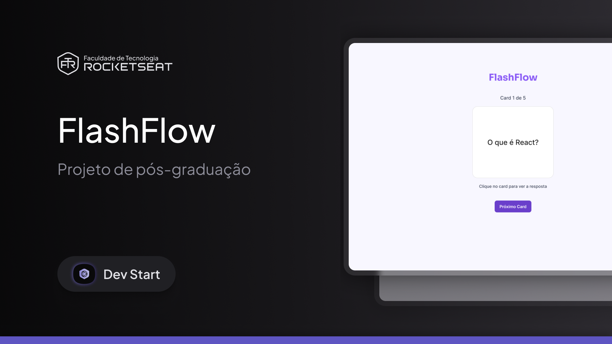
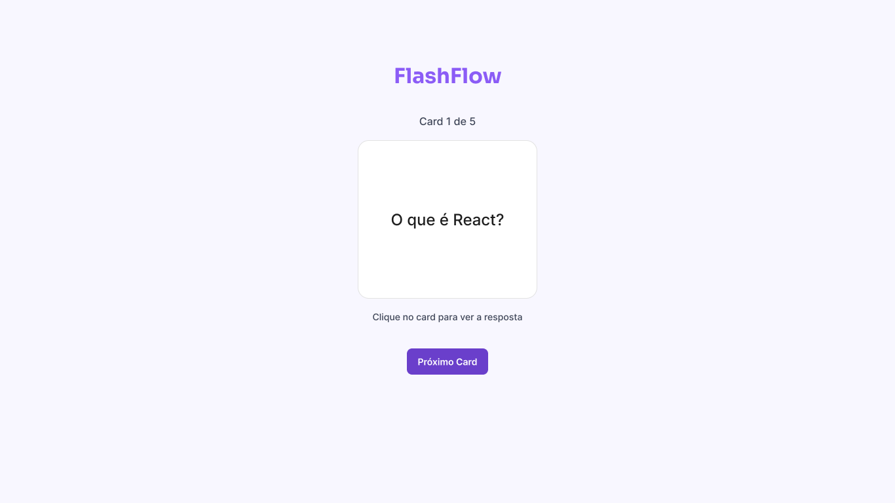

# 📘 Flashflow



Flashflow é um projeto de **flashcards interativos** desenvolvido com **HTML, CSS e JavaScript puro**, como parte da pós-graduação _Start Dev_ da Rocketseat.

O objetivo é proporcionar uma ferramenta de estudo por repetição ativa, onde o usuário interage com perguntas e respostas de forma dinâmica. Essa abordagem auxilia na memorização de conteúdos como conceitos técnicos, definições e fórmulas, fixando o aprendizado na memória de longo prazo.

---

## 💡 Descrição do Desafio

Desenvolver um site desktop de flashcards que apresenta:

- Um **card com uma pergunta** (frente);
- Ao **clicar no card**, exibe a resposta (verso);
- Um botão **"Próximo Card"** para navegar;
- Um contador com o **progresso atual**, ex: "Card 2 de 5".

As perguntas e respostas devem seguir a estrutura padrão:

```javascript
const flashcards = [
  {
    question: "O que é JavaScript?",
    answer: "JavaScript é uma linguagem de programação interpretada...",
  },
  // ...
];
```

---

## ✨ Funcionalidades

- ✅ Exibe perguntas e respostas em formato de flashcard.
- 🔄 Clique no card para alternar entre pergunta e resposta.
- 👉 Botão **"Próximo Card"** para avançar no baralho.
- 📢 Mensagem ao finalizar todos os cards.
- 🔁 Botão **"Recomeçar"** para reiniciar os cards embaralhados.
- 📊 Contador de progresso (ex.: "Card 3 de 5").
- 🎯 Layout responsivo com animação suave de virada (flip).

---

## 🖼️ Prévia do Projeto



---

## ⚙️ Tecnologias Utilizadas

- HTML5
- CSS3
- JavaScript (Vanilla)

---

## 📁 Estrutura de Pastas

```
flashflow/
│
├── assets/
│   ├── favicon.ico
│   ├── capa-projeto.png
│   └── projeto.png
│
├── index.html
├── styles.css
├── script.js
└── readme.md
```

---

## 🧠 Como Usar

1. Clone ou baixe este repositório.
2. Abra o arquivo `index.html` no navegador.
3. Clique no card para revelar a resposta.
4. Use o botão **"Próximo Card"** para continuar.
5. Após o último card, clique em **"Recomeçar"** para iniciar novamente com os cards embaralhados.

---

## 📚 Aprendizados Aplicados

Este desafio foi criado para reforçar conceitos essenciais de desenvolvimento web:

- Manipulação do DOM com JavaScript.
- Tratamento de eventos e estados.
- Estruturação de layouts com HTML e CSS.
- Lógica de programação
- Boas práticas de estruturação de projetos web
- UX simples e eficaz.

---

## 👨‍💻 Autor

Desenvolvido por **Rocketseat**  
Adaptado e implementado por **William Milanez**  
📍 Pós-graduação Start Dev – Desafio Fase 1 – _Flashflow_

---

## 📄 Licença

Este projeto é de uso educacional e livre para fins de estudo e prática pessoal.

---
